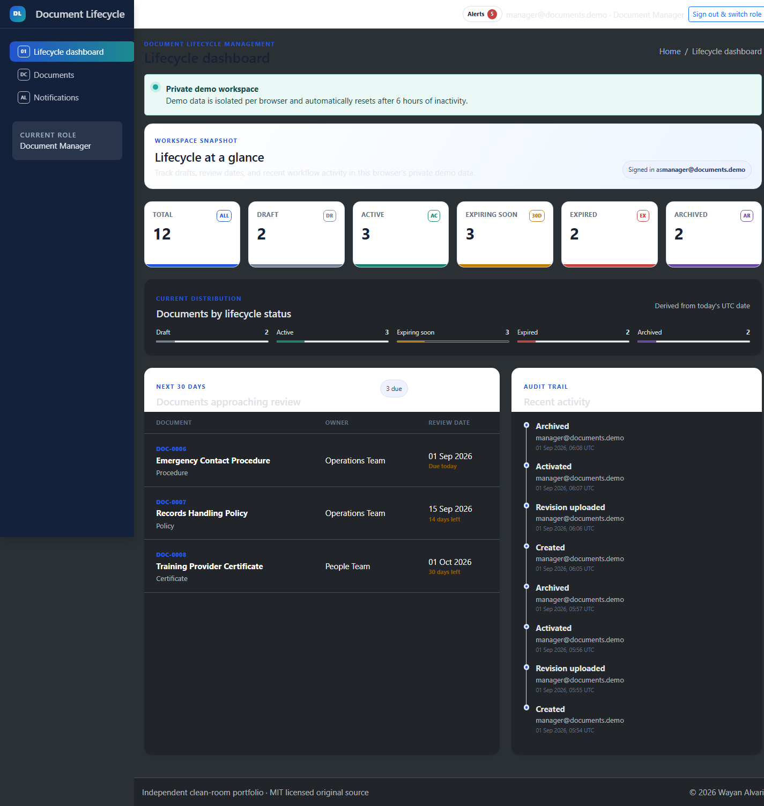
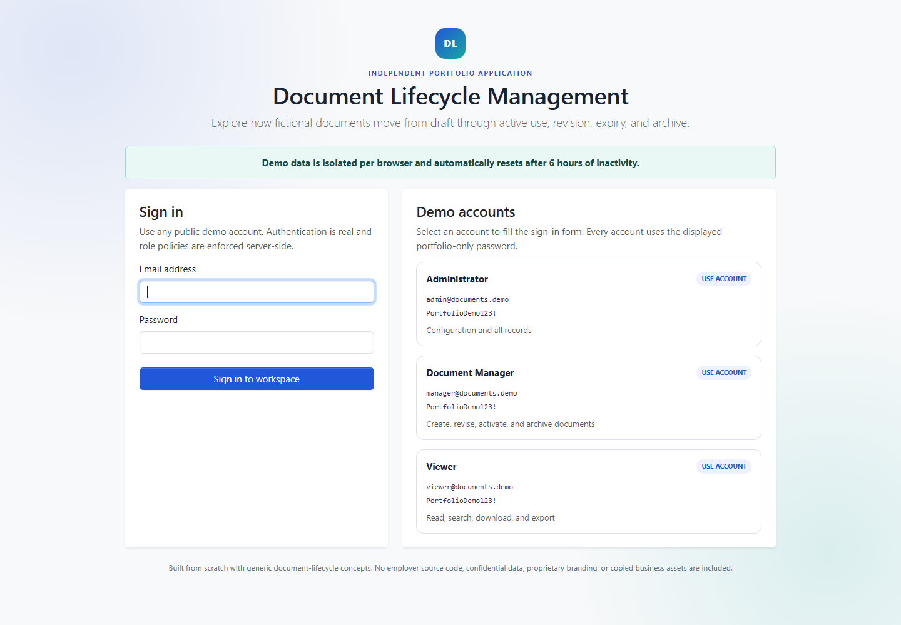
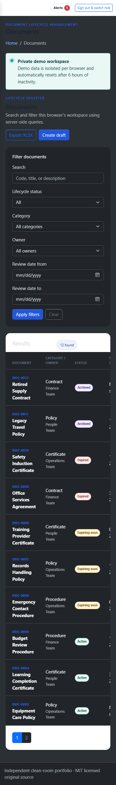

# Document Lifecycle Management

Document Lifecycle Management is an original portfolio-sized ASP.NET Core MVC application that demonstrates a complete document workflow: draft creation, protected revisions, activation, review-date alerts, archive/restore, immutable activity history, and filtered XLSX/PDF exports.

The application is intentionally a focused modular monolith rather than an enterprise records-management product. Every demo browser receives an isolated fictional workspace.

## Screenshots



<details>
<summary>More application views</summary>





</details>

## What the application demonstrates

- ASP.NET Core Identity sign-in with Administrator, Document Manager, and Viewer policies enforced server-side.
- Per-browser workspaces protected by an encrypted, HTTP-only cookie and global EF Core workspace filters.
- Draft, active, expiring soon, expired, and archived lifecycle states with UTC timestamps and deterministic review-date rules.
- Private PDF, PNG, and JPEG revision storage outside `wwwroot`, including extension/media/signature checks, a 10 MB limit, random physical names, SHA-256 hashes, and authorized streaming downloads.
- Search, lifecycle/category/owner/date filters, responsive dashboard metrics, role-targeted notifications, and immutable audit history.
- Filter-preserving XLSX exports and compact PDF metadata/history summaries that never embed the uploaded document.
- MySQL 8 code-first migrations for the application and SQLite in-memory integration tests that need no database credential.
- Safe error pages, structured logs without form values, login rate limiting, antiforgery validation, restrictive security headers, and a lightweight `/health` endpoint.

## Demo behavior

> Demo data is isolated per browser and automatically resets after 6 hours of inactivity.

A new browser profile receives 12 clearly fictional documents, reference data, revisions, and audit activity. A different browser or private profile cannot access that workspace. Meaningful authenticated activity extends the six-hour window; polling does not. Expired workspace rows and private uploads are removed together.

To start a fresh workspace immediately, clear site data for the local origin or open a different browser profile. The previous workspace remains inaccessible and is removed by the cleanup service after expiry.

## Demo accounts

All demo accounts use the public portfolio-only password `PortfolioDemo123!`.

| Role | Email | Main capability |
|---|---|---|
| Administrator | `admin@documents.demo` | Configuration, audit history, and all documents |
| Document Manager | `manager@documents.demo` | Create, revise, activate, archive, and restore documents |
| Viewer | `viewer@documents.demo` | Read active/archived documents, download, audit, and export; drafts remain hidden |

The sign-in page displays these same credentials. Registration, password reset, external login, user administration, and privilege changes are intentionally unavailable.

## Technology and structure

- .NET SDK 8.0.424, .NET/ASP.NET Core 8.0.30, and C# 12
- ASP.NET Core MVC, Identity, authorization policies, and EF Core
- MySQL Community Server 8.0.46 through Pomelo 8.0.3
- SQLite in-memory relational integration tests
- AdminLTE 4.1.0, Bootstrap 5.3.8, and vanilla JavaScript from locked npm packages
- ClosedXML 0.105.1 and PDFsharp/MigraDoc 6.2.4
- xUnit v2 with built-in assertions

```text
src/
  DocumentLifecycle.Domain/          lifecycle entities and rules
  DocumentLifecycle.Application/     use-case contracts and DTOs
  DocumentLifecycle.Infrastructure/  EF Core, Identity, files, seed, reports
  DocumentLifecycle.Web/             MVC, Razor, middleware, local assets
tests/
  DocumentLifecycle.UnitTests/
  DocumentLifecycle.IntegrationTests/
docs/
scripts/
```

Package versions are centralized in `Directory.Packages.props`; every project has a committed `packages.lock.json`. Frontend assets are copied only from the exact npm lock into ignored `wwwroot/vendor` output.

## Prerequisites

- Git 2.46 or later
- .NET SDK 8.0.424 (the repository `global.json` selects this servicing line)
- Node.js 20 or later and npm 10 or later
- MySQL Community Server 8.0.46 only for the MySQL path; the quick start can use local SQLite

Verify the workstation:

```powershell
dotnet --version
node --version
npm --version
git --version
```

## Quick start with SQLite

This credential-free path is the fastest way to review the portfolio locally. It uses the same MVC application and EF model as MySQL; the normal automated suite also uses SQLite.

```powershell
git clone <repository-url> Document-Lifecycle-Management
Set-Location Document-Lifecycle-Management

dotnet tool restore
dotnet restore --locked-mode
npm ci

$env:ASPNETCORE_ENVIRONMENT = "Development"
$env:Database__Provider = "Sqlite"
$env:Database__SqliteConnection = "Data Source=document-lifecycle.local.db"
$env:FileStorage__RootPath = "./uploads"

dotnet run --project src/DocumentLifecycle.Web --launch-profile http --no-restore
```

Open `http://localhost:5142/`. On first development start, SQLite creates its schema from the EF model and the public demo identities are seeded idempotently. MySQL continues to use the committed migrations. The local database and upload directory are ignored by Git.

Equivalent Bash environment variables use `export`, for example:

```bash
export ASPNETCORE_ENVIRONMENT=Development
export Database__Provider=Sqlite
export Database__SqliteConnection='Data Source=document-lifecycle.local.db'
export FileStorage__RootPath=./uploads
dotnet run --project src/DocumentLifecycle.Web --launch-profile http --no-restore
```

## Local MySQL setup

Run the following as a MySQL administrator, replacing the password placeholder locally. The account is limited to this one database; schema privileges are included because the documented development flow applies migrations.

```sql
CREATE DATABASE portfolio_document_lifecycle
  CHARACTER SET utf8mb4
  COLLATE utf8mb4_0900_ai_ci;

CREATE USER 'document_lifecycle_app'@'localhost'
  IDENTIFIED BY '<replace-with-a-local-password>';

GRANT SELECT, INSERT, UPDATE, DELETE, CREATE, ALTER, DROP, INDEX, REFERENCES
  ON portfolio_document_lifecycle.*
  TO 'document_lifecycle_app'@'localhost';

FLUSH PRIVILEGES;
```

Store the real connection string in user secrets, never in a tracked file:

```powershell
dotnet user-secrets set --project src/DocumentLifecycle.Web `
  "ConnectionStrings:DefaultConnection" `
  "Server=127.0.0.1;Port=3306;Database=portfolio_document_lifecycle;User=document_lifecycle_app;Password=<replace-locally>;CharSet=utf8mb4"
```

Restore tools and apply the reviewed migrations:

```powershell
dotnet tool restore
dotnet ef database update `
  --project src/DocumentLifecycle.Infrastructure `
  --startup-project src/DocumentLifecycle.Web `
  --context ApplicationDbContext
```

Then run with the Development environment. `appsettings.json` selects MySQL and `appsettings.Development.json` enables the isolated demo mode.

```powershell
dotnet run --project src/DocumentLifecycle.Web --launch-profile http --no-restore
```

MySQL is not required by the normal test suite. See [the optional MySQL smoke procedure](docs/mysql-smoke-test.md) when a local test credential is available.

## Recruiter workflow

1. Sign in as Document Manager.
2. Create a draft and upload a small PDF, PNG, or JPEG revision with a change note.
3. Activate the now-eligible draft.
4. Filter the register by lifecycle/review date and inspect notifications.
5. Upload a second revision and review the document timeline.
6. Archive with a reason, then restore the document.
7. Export the filtered register to XLSX and the document metadata/history to PDF.
8. Switch to Viewer and confirm drafts and manager commands are unavailable.
9. Switch to Administrator to manage categories/owners and inspect the full audit log.
10. Open another private browser profile and confirm the first workspace is invisible.

## Tests and quality gates

Run the complete local gate set from the repository root:

```powershell
dotnet tool restore
dotnet restore --locked-mode
npm ci
npm audit --omit=dev
dotnet format --verify-no-changes
dotnet build DocumentLifecycle.sln -c Release --no-restore
dotnet test DocumentLifecycle.sln -c Release --no-build --no-restore
dotnet list DocumentLifecycle.sln package --vulnerable --include-transitive
dotnet list DocumentLifecycle.sln package --deprecated
```

Collect coverage as a local artifact when needed:

```powershell
dotnet test DocumentLifecycle.sln -c Release `
  --collect:"XPlat Code Coverage" `
  --results-directory coverage
```

The dependency assessment is tracked in [docs/dependency-audit.md](docs/dependency-audit.md). The test-only xUnit v2 deprecation is recorded there; the published web application has no deprecated runtime package.

## Publish and operations

The project deliberately contains no container configuration and performs no deployment. See [docs/manual-hosting.md](docs/manual-hosting.md) for framework-dependent and self-contained publish commands, explicit demo initialization, Data Protection key persistence, MySQL migration choices, reverse-proxy/HTTPS guidance, health checks, logs, backups, and rollback.

A local framework-dependent rehearsal is:

```powershell
dotnet publish src/DocumentLifecycle.Web/DocumentLifecycle.Web.csproj `
  -c Release --no-restore `
  -o .publish/framework-dependent `
  /p:UseAppHost=false
```

## Security notes

- Uploaded content is private and never served as a static file.
- State-changing MVC actions require antiforgery tokens; role policies and workspace filters are enforced on the server.
- Production cookies require HTTPS. Login attempts are rate-limited per remote address.
- CSP, clickjacking, MIME-sniffing, referrer, opener, and browser-permission headers are applied globally.
- `/health` reports liveness only and deliberately exposes no database or configuration details.
- Logs include method, path, status, and duration, but never request bodies, passwords, cookies, connection strings, or file contents.

Security reports should follow the private process in [SECURITY.md](SECURITY.md).

## Clean-room statement and license

> This independent portfolio project was built from scratch using generic document-lifecycle concepts. It contains no employer source code, confidential data, proprietary branding, or copied business assets.

Original repository source is licensed under the [MIT License](LICENSE), Copyright (c) 2026 Wayan Alvari. Third-party components retain their own licenses and are listed in [THIRD-PARTY-NOTICES.md](THIRD-PARTY-NOTICES.md). See the full [clean-room declaration](CLEAN-ROOM-DECLARATION.md).
